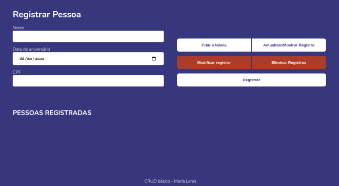

  

# 
 

CRUD básico

#

## Projeto
A aplicacão  realiza as operacoes de um CRUD básico, listanto as pessoas cadastradas no banco de dados, permitendo incluir, alterar e excluir os registros.

## 🚀 Ejecutar o projecto

Essas instruções permitirão que você obtenha uma cópia do projeto em execução em sua máquina local para fins de desenvolvimento e teste.

### Instalação e execução 🔧

1. Clone o repositorio
git clone https://github.com/marialares/CRUDbasico

2. Entre no diretório
  CRUDbasico

3. Instale a extensão
  LiveServer

4. Inicie el servidor de desenvolvimiento
  abra o arquivo index.html com a extensão LiveServer

### Após a etapa anterior, uma guia será aberta automaticamente em seu navegador com o projeto.

## Tecnologías Utilizadas 🛠️

* [JavaScript](https://www.javascript.com/)
* [HTML](https://www.w3schools.com/html/)
* [CSS](https://www.w3.org/Style/CSS/Overview.en.html)

## :memo: Licença

Este projeto está sob a Licença MIT - veja o arquivo [LICENSE](LICENSE.md) para mais detalhes.

---
⌨️ com ❤️ por [Maria Lares](www.linkedin.com/in/maria-lares) 😊